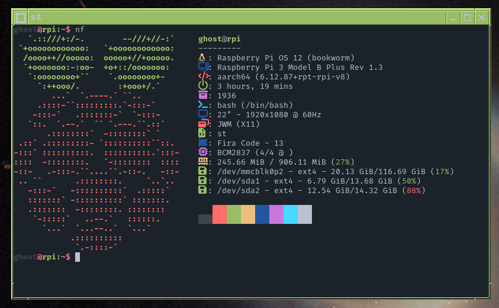

# regexghost's dotfiles

This repo contains all my dotfiles, including:
* Configuration for various programs
* Window manager and desktop environment setups
* Terminal, window manager and panel scripts
* Small programs I've written
* Install guides for various OS setups

This repo is a work in progress, as well as standard dotfiles updates I also plan to add scripts which can be used to save/load the dotfiles

More information about specific WM/DE setups can be found below, both the dotfiles themselves and relevant articles on my website

## General Setup Guide

`./init.sh`  
`./setup.sh make dotfiles`  
`./setup.sh make <wm/de>`  
`./otherPrograms.sh mine`  
`./otherPrograms.sh notmine` (will take a while, checks with user after every command)

## Colour Schemes

Before loading the dotfiles, navigates to `helpers/colours/` and run `make.sh *colourscheme*`, where `*colourscheme*` is a scheme in `helpers/colours/schemes/` (without the `.sh`)  
This will place relevant colourschemee substitution files in the correct directories to be loaded with the config files. These files aren't tracked in the repo as there a) there is a large number of them and b) they can be generated programatically from the `schemes/` files.

## Guides

[Arch install](/guides/archInstallGuide.md)  
[Firefox setup](/guides/firefox.md)  
[New git repo (GitHub)](/guides/git.md)  
[Windows ISO USB](/guides/windowsFromLinux.md)  
[Samba setup](/guides/samba.md)  
[Some useful commands](/guides/commands.txt)
